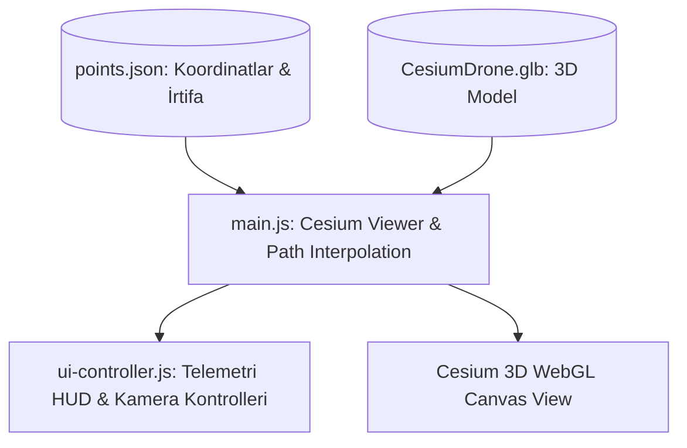

# 🛸 Cesium Drone - 3D Geospatial Drone Flight & Telemetry Simulator

[](https://developer.mozilla.org/)
[](https://cesium.com/platform/cesiumjs/)
[](https://webpack.js.org/)
[](https://www.khronos.org/gltf/)
[](https://www.yucelgumus.dev/)

> **CesiumJS** 3D küre motoru ve **Webpack 5** mimarisi üzerinde çalışan; önceden tanımlanmış coğrafi koordinat rotaları boyunca 3 boyutlu drone uçuşunu simüle eden, anlık telemetri (hız, irtifa, yön) ve dinamik kamera takip modları sunan interaktif CBS simülasyonu.

---

## 🌟 Öne Çıkan Özellikler

- 🌐 **3 Boyutlu Küresel Harita (CesiumJS 3D Globe):** Yüksek çözünürlüklü uydu görüntüleri ve gerçek dünya arazi yükseltisi (terrain) üzerinde simülasyon.
- 🚁 **3D Drone Modeli & Rota Takibi:** Özel `.glb` 3D drone modelinin arazi koordinatları (`points.json`) boyunca pürüzsüz interpolasyon ile uçuş yapması.
- 📟 **Canlı Uçuş Telemetrisi Paneli:** Anlık yükseklik (irtifa), uçuş hızı, koordinat konumu ve pusula yönü bilgileri (`ui-controller.js`).
- 🎥 **Çoklu Kamera Takip Modları:**
  - *Takip Kamerası (Chase Cam):* Drone arkasından birinci şahıs uçuş hissi.
  - *Serbest Kamera (Free Cam):* Kullanıcının haritada serbestçe dolaşabilmesi.
  - *Kuşbakışı (Top-Down):* Rota genel görünümü.
- ⚡ **Optimize Webpack 5 Yapılandırması:** CesiumJS statik asset'lerini ve worker'larını sorunsuz paketleyen modern derleyici yapısı.

---

## 🏗️ Mimari & Simülasyon Akışı



---

## 🚀 Hızlı Başlangıç

### Gereksinimler
- **Node.js**: v16.0 veya üstü
- **Cesium Ion Access Token** ([Cesium Ion](https://ion.cesium.com/)'dan temin edilebilir)

### Kurulum

```bash
git clone https://github.com/yucel-gumus/cesium-drone.github.io.git
cd cesium-drone.github.io

npm install
```

### Ortam Değişkenleri (`.env`)

```env
CESIUM_ION_TOKEN=your_cesium_ion_token_here
```

### Çalıştırma

```bash
npm start
```

Uygulama varsayılan olarak `http://localhost:8080` adresinde açılacaktır.

---

## 📂 Proje Dizin Yapısı

```
cesium-drone.github.io/
├── CesiumDrone.glb                 # 3D Drone modeli
├── webpack.config.js               # Webpack Cesium yapılandırması
├── package.json
├── public/
│   └── points.json                 # Uçuş rota noktaları ve koordinatları
└── src/
    ├── index.html                  # Ana sayfa ve HUD katmanı
    ├── main.js                     # CesiumJS simülasyon başlatıcı
    ├── ui-controller.js            # Telemetri ve buton kontrolleri
    ├── config.js                   # Simülasyon sabitleri ve token
    └── style.css                   # HUD stilleri
```

---

## 📄 Lisans
Bu proje [MIT Lisansı](LICENSE) ile lisanslanmıştır.

---

## 👨‍💻 Geliştirici & İletişim

**Yücel Gümüş** - Full Stack Developer

- 🌐 **Web Sitesi / Portfolyo:** [yucelgumus.dev](https://www.yucelgumus.dev/)
- 💼 **LinkedIn:** [linkedin.com/in/yucel-gumus](https://www.linkedin.com/in/yucel-gumus/)
- 🐙 **GitHub:** [@yucel-gumus](https://github.com/yucel-gumus)

<p align="left">
  <a href="https://www.yucelgumus.dev/" target="_blank" rel="noopener noreferrer">
    
  </a>
</p>